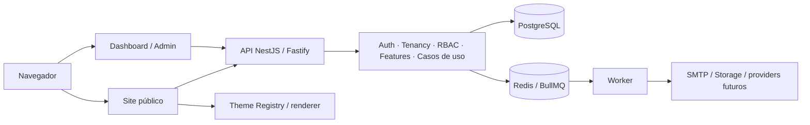

# Arquitetura da plataforma

## Decisão

Adotar um **monólito modular em TypeScript** dentro de um monorepo pnpm + Turborepo. Módulos têm responsabilidade e API interna explícitas, sem chamadas HTTP entre módulos do mesmo backend. Worker separado permite processar tarefas assíncronas e escalar execução sem transformar o produto em microsserviços.

```text
apps/
  web-public/     Next.js: sites por hostname e renderização de temas
  dashboard/      Next.js: acesso dos membros da barbearia
  admin/          Next.js: administração da plataforma
  api/            NestJS + Fastify: REST, OpenAPI e casos de uso
  worker/         BullMQ: consumidores e adapters assíncronos
packages/
  database/ auth/ tenancy/ billing/ domains/ booking/
  notifications/ storage/ analytics/
  ui/ design-system/ theme-engine/ themes/
  config/ validation/ types/ observability/
```

Essa é a divisão de responsabilidades do repositório. Pacotes reservados para fases futuras devem declarar seu estado e não simular uma implementação comercial.

## Dependências e execução

Os três frontends usam React e App Router. Componentes visuais vivem em `ui` e `design-system`; contratos compartilhados e validações evitam importar código servidor para bundles do navegador. React Hook Form, TanStack Query e animações entram quando os fluxos justificarem seu uso, sem acrescentar bibliotecas apenas para preencher a stack.

A API resolve identidade e tenant, verifica membership, permissão e feature, valida o payload e invoca o módulo responsável. Prisma 7 e PostgreSQL oferecem persistência compartilhada. Repositórios explicitamente limitados pelo tenant e relações compostas formam a primeira barreira de isolamento; [MULTI_TENANCY.md](MULTI_TENANCY.md) detalha os limites.

Better Auth cuida do ciclo da sessão. A autorização de negócio continua nos módulos da plataforma. Redis + BullMQ transportam jobs; cada job de domínio carrega contexto tenant validado. E-mail sai por adapter SMTP, com Mailpit local. Storage local é MinIO; produção adotará um adapter S3 compatible/R2.



## Implementação atual e limites

A Foundation estabelece as fronteiras. A Fase 1 acrescenta catálogo e agenda interna no dashboard, com proxies de mesma origem e casos de uso tenant-scoped na API. O pacote `booking` calcula calendário IANA, intervalos e transições sem banco ou integrações externas. A API revalida disponibilidade em transação com lock por unidade, exclusão PostgreSQL, idempotência, snapshots e auditoria.

Onboarding e gestão de unidades estão disponíveis no dashboard/API. A reserva pública possui endpoints de disponibilidade e criação, com comprovante mínimo e sem alteração de cadastro existente; a jornada visual e a verificação do telefone continuam pendentes. As [confirmações WhatsApp](WHATSAPP.md) da agenda interna usam outbox PostgreSQL e adapter Meta; a ativação externa depende das credenciais e template. Mercado Pago, Cloudflare, processamento de mídia e analytics têm decisões para implementação posterior. Não há Kubernetes, banco por cliente, deploy por tenant ou código tenant executável no runtime.

Publicação, migrations e infraestrutura produtiva precisam dos gates de [DEPLOYMENT.md](DEPLOYMENT.md). Mudanças estruturais relevantes devem registrar o problema, alternativas e consequências em [ADRs](adr/0001-modular-monolith.md).
